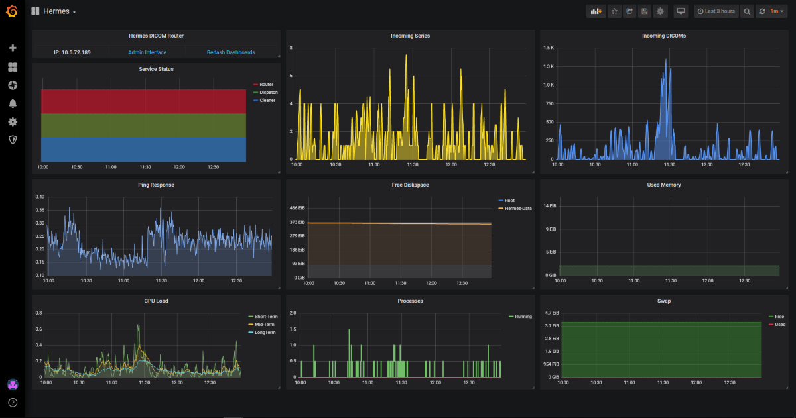
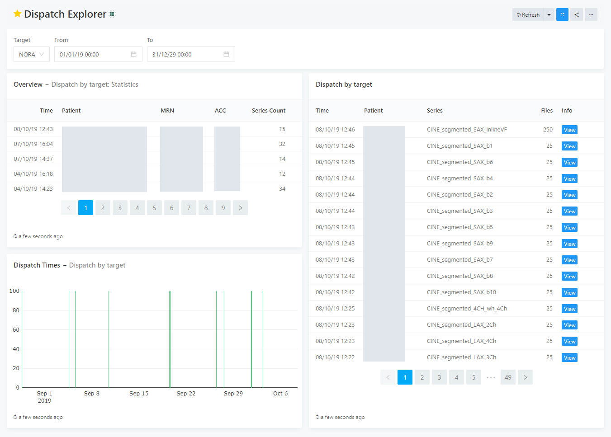
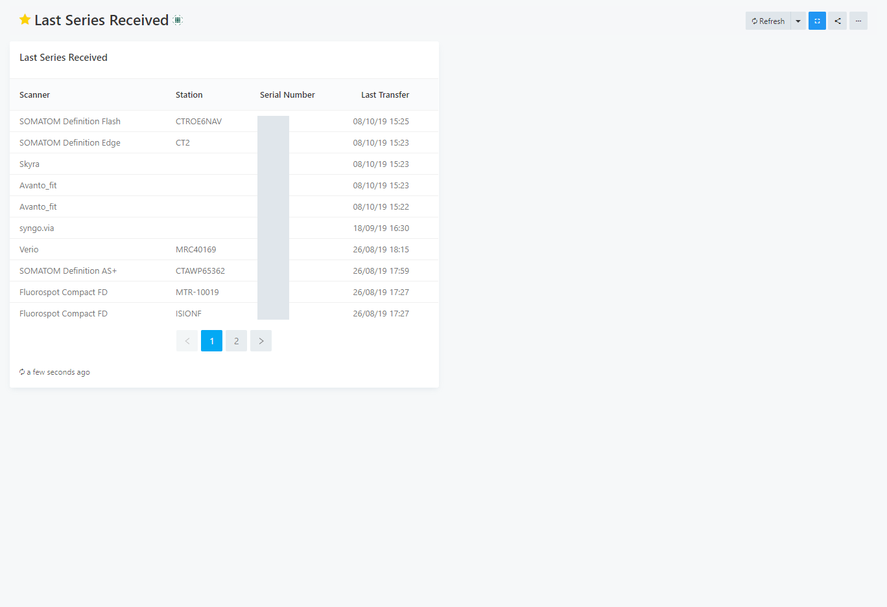

Dashboard Gallery
=================

.. important:: The information on this page is still being updated for mercure version 0.2.

.. highlight:: SQL

Using Redash and Graphite, various custom dashboards can be created that visualize and analyze the data collected by the mercure router. Below are examples for dashboards that we created for our installation (the corresponding Redash queries are shown in SQL syntax, so that the dashboards can be reproduced).

.. contents::
    :local:
    :depth: 1

.. note:: Areas containing PHI have been blinded in the screenshots.

--------

Router Health
-------------

The health of the mercure router can be monitored using Graphite for data collection and Grafana for dashboard creation and alerting. Shown below is an exemplary dashboard that we are using to monitor our router, which combines data provided by the collectd service running on the server, by the collectd service running on a different server (for measuring the ping response), and directly by the different mercure services. 

The diagram shown in the top-left utilizes the data transmitted by the mercure services during each run. If one of the colored blocks disappears for a longer period of time, it indicates that the process might be hanging. Useful are also the other diagrams in the top row, showing pending files and series in the incoming folder as reported by the router module, which can indicate if the server is not able to keep up with the load created by the scanners.

--------

Dispatch Explorer
-----------------

The Redash dashboard "Dispatch Explorer" allows showing which patient series have been dispatched to a selected target in a selectable time frame. It links to the "Series Events" dashboard that summarizes all information collected for a particular series.

It uses the following SQL queries (upper query: left-top table, lower query: left-bottom graph & right table):

::

    select 
    max(dicom_series.time) as Time,
    min(dicom_series.tag_patientname) as Patient,
    min(dicom_series.tag_patientid) as MRN,
    dicom_series.tag_accessionnumber as ACC,
    count(dicom_series.series_uid) as Series_Count
    from series_events
    join dicom_series on dicom_series.series_uid=series_events.series_uid
    where 
    series_events.event='DISPATCH'
    and
    series_events.target='{{target}}'
    and
    series_events.time >='{{from}}'
    and
    series_events.time <= '{{to}}'
    group by dicom_series.tag_accessionnumber
    order by time desc
    limit 1000;

::

    select 
    series_events.time,
    dicom_series.tag_patientname as Patient,
    dicom_series.tag_seriesdescription as Series,
    series_events.file_count as Files,
    '<a href="/dashboard/series-events_1?p_series_uid=' || series_events.series_uid ||'" target="_blank" class="btn btn-primary btn-xs">View</a>' as Info
    from series_events
    join dicom_series on dicom_series.series_uid=series_events.series_uid
    where 
    series_events.event='DISPATCH'
    and
    series_events.target='{{target}}'
    and
    series_events.time >='{{from}}'
    and
    series_events.time <= '{{to}}'
    order by series_events.time desc
    limit 1000;

--------

Last Series Received
--------------------

The dashboard "Last Series Received" shows the time when the last series from any imaging device has been received. It can be used to detect if there are problems with the DICOM transfer from one of the scanners. The query can be easily modified to provide a trigger for automatic alerts.

It uses the following query:

::

    select 
    min(tag_manufacturermodelname) as "Scanner",
    min(tag_stationname) as "Station",
    tag_deviceserialnumber as "Serial Number",
    max(time) as "Last Transfer"
    from
    dicom_series
    where (tag_deviceserialnumber <> '') is true
    group by dicom_series.tag_deviceserialnumber
    order by max(time) desc
    limit 500;

--------

Received Series
---------------

The "Received Series" dashboard shows all series that have been received by the router in descending chronological order, with links to the "Series Events" dashboard for details on the series. Using the UI controls on top of the dashboard, series can be searched by patient name, MRN, ACC, and modality.

.. image:: dashboards_receivedseries.png
   :width: 550px
   :align: center
   :class: border

It uses the following query:

::

    SELECT
    time,
    tag_patientname as Patient_Name,
    tag_patientid as MRN,
    tag_accessionnumber as ACC,
    tag_modality as Modality,
    tag_seriesdescription as Series,
    tag_protocolname as Protocol,
    tag_bodypartexamined as Body_Part,
    '<a href="/dashboard/series-events_1?p_series_uid=' || series_uid ||'" target="_blank" class="btn btn-primary btn-xs">View</a>' as History
    FROM
    dicom_series
    WHERE
    CASE
        WHEN '{{modality}}' = '*' THEN
        dicom_series.tag_modality is not null
        ELSE
        dicom_series.tag_modality = '{{modality}}'
        END
    AND    
    CASE
        WHEN '{{patientname}}' = '*' THEN
        dicom_series.tag_patientname is not null
        ELSE
        dicom_series.tag_patientname ilike '%{{patientname}}%'
        END
    AND
    CASE
        WHEN '{{mrn}}' = '*' THEN
        dicom_series.tag_patientid is not null
        ELSE
        dicom_series.tag_patientid ilike '%{{mrn}}%'
        END
    AND
    CASE
        WHEN '{{acc}}' = '*' THEN
        dicom_series.tag_accessionnumber is not null
        ELSE
        dicom_series.tag_accessionnumber ilike '%{{acc}}%'
        END
    order by time desc;

--------

Series Events
-------------

The "Series Events" dashboard shows all information collected for a particular series, including DICOM tag information on the left side and a journal of how this series has been processed on the right side.

.. image:: dashboards_seriesevents.png
   :width: 550px
   :align: center
   :class: border

It uses the following queries (upper query: left table, lower query: right table):

::

    SELECT
    unnest(array[
        'Series UID', 
        'Acquisition Time',
        'Patient Name',
        'DOB',
        'Gender',
        'MRN',
        'ACC',
        'Body Part',
        'Modality',
        'Study Description',
        'Series Description',
        'Protocol Name',
        'Sequence Name',
        'Scanning Sequence',
        'Sequence Variant',
        'Contrast Bolus Agent',
        'Scanner Model',
        'Scanner Serial',
        'Magnetic Field Strength',
        'Slice Thickness'
    ]) AS "Field",
    unnest(array[
        series_uid, 
        tag_acquisitiondate || ', ' || tag_acquisitiontime,
        tag_patientname,
        tag_patientbirthdate,
        tag_patientsex,
        tag_patientid,
        tag_accessionnumber,
        tag_bodypartexamined,
        tag_modality,
        tag_studydescription,
        tag_seriesdescription,
        tag_protocolname,
        tag_sequencename,
        tag_scanningsequence,
        tag_sequencevariant,
        tag_contrastbolusagent,
        tag_manufacturermodelname,
        tag_deviceserialnumber,
        tag_magneticfieldstrength,
        tag_slicethickness
    ]) AS "Value"
    FROM 
    dicom_series
    where 
    series_uid = '{{series_uid}}';

::

    select 
    time as Time,
    event as Event,
    file_count as Files,
    target as Target,
    info as Info
    from
    series_events
    where 
    series_uid = '{{series_uid}}'
    order by time asc;

--------

System Status
-------------

The "System Status" dashboard shows all system and webgui events in descending chronological order. Moreover, it shows all error events in the top-right table.

.. image:: dashboards_systemstatus.png
   :width: 550px
   :align: center
   :class: border

It uses the following queries (upper query: left table, middle query: right-top, lower query: right-bottom table):

::

    select 
    time as Time,
    sender as Sender,
    event as Event,
    severity as Severity,
    description as Description
    from 
    mercure_events
    order by time desc
    limit 1000;

::

    select 
    time as Time,
    sender as Sender,
    event as Event,
    severity as Severity,
    description as Description
    from 
    mercure_events
    where severity > 0
    order by time desc
    limit 1000;

::

    select 
    time as Time,
    webgui_events.user as User,
    event as Event,
    description as Description
    from webgui_events
    order by time desc;
