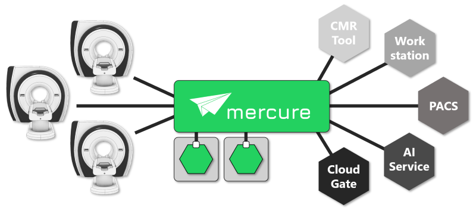

mercure DICOM Orchestrator
==========================

mercure is a flexible open-source DICOM orchestration platform. It offers an intuitive web-based user interface as well as extensive monitoring options, making it suitable for routine applications that require high availability. It can be used for dispatching DICOM studies to different targets based on easily definable routing rules and for processing DICOM series with custom-developed algorithms, such as inference of AI models for medical imaging. Processing algorithms can either be executed directly on a mercure server (as Docker containers) or can be executed on connected cluster nodes, typically located on premise but possibly also running as cloud instances. Implemented processing modules can be shared via Docker Hub.

.. important:: Some sections of the documentation are still being updated for mercure version 0.2. Pages with information that require modification are marked accordingly. 

.. toctree::
   :hidden:
   :maxdepth: 2

   github.com/mercure-imaging/mercure <https://github.com/mercure-imaging/mercure>

.. toctree::
   :caption: User Guide
   :maxdepth: 2

   intro
   quickstart
   install
   usage
   monitoring
   dashboards
   advanced
   modules

.. toctree::
   :maxdepth: 1
   :titlesonly:

   faq

.. toctree::
   :caption: Support
   :maxdepth: 2

   support

.. toctree::
   :caption: Developer Information
   :maxdepth: 2

   environment
   code
   roadmap
