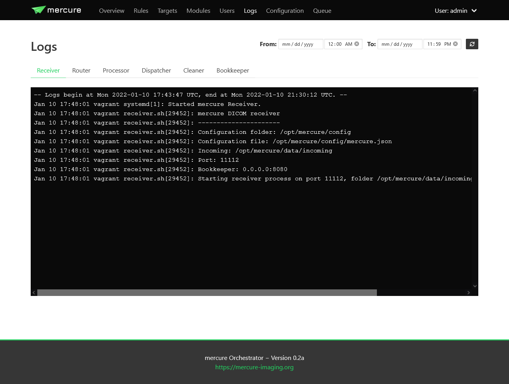

Monitoring
==========

.. important:: The information on this page is still being updated for mercure version 0.2.

mercure provides three different mechanisms for monitoring the server activity and health.

Log files
---------

All mercure services write detailed logging information with timestamps into system log files. The most convenient way to review these logs is to use the "Logs" page of the mercure web interface. Here you can see a separate tab for every service. The logs are updated whenever you switch between tabs and when you click the refresh button on the top-right.

Using the From/To controls, you can limit the time span that is shown in the log viewer.

.. note:: Only the last 1000 lines of each log are displayed to keep the user interface responsive. If you are looking for an older event, use the From/To fields to narrow down the time span.

.. tip:: The log files can also be viewed in the terminal using the journalctl command by providing the service name as argument. For example, "journalctl -u mercure_ui.service" shows the log of the webgui. You can see the names of the different services as tooltip when hovering over the tabs on the "Logs" page.

Graphite
--------

`Graphite <https://graphiteapp.org/>`_ is a very powerful tool for monitoring the health of a server. It can collect time-series data from various sources and stores the data in a database. Instead of displaying the data directly with Graphite, the collected data is often visualized using `Grafana <https://grafana.com/>`_, which makes it very easy to create dashboards for various data sources and to setup alerts. 

We highly recommend that you monitor your mercure server with Graphite and Grafana. In a typical setup, Graphite and Grafana are running on a separate monitoring server. Basic health parameters like the available disk space, CPU load, and memory usage can be collected by installing the `collectd <https://collectd.org/>`_ service on your server, which will transmit the information to your Graphite instance. 

mercure can transmit additional information about its activities to Graphite. To enable it, shutdown all mercure services and edit the keys graphite_ip and graphite_port in the file mercure.json (here you need to enter the IP and port of your Graphite instance). Afterwards, restart the mercure services.

mercure transmits the following information to Graphite:

======================================== ===========================================================================
Key                                      Meaning
======================================== ===========================================================================
mercure.router.main.incoming.series      Number series in the incoming folder waiting for completion
mercure.router.main.incoming.files       Number of received DICOM files waiting in the incoming folder
mercure.router.main.events.run           Triggered when the router checks for incoming files (value=1)
mercure.router.main.events.boot          Triggered when the router is started (value=1)
mercure.router.main.events.shutdown      Triggered when the router shuts down (value=1)
mercure.dispatcher.main.events.run       Triggered when the dispatcher checks for outgoing series (value=1)
mercure.dispatcher.main.events.boot      Triggered when the dispatcher is started (value=1)
mercure.dispatcher.main.events.shutdown  Triggered when the dispatcher shuts down (value=1)
mercure.cleaner.main.events.run          Triggered when the cleaner checks for files to-be-deleted (value=1)
mercure.cleaner.main.events.boot         Triggered when the cleaner is started (value=1)
mercure.cleaner.main.events.shutdown     Triggered when the cleaner shuts down (value=1)
======================================== ===========================================================================

By creating a visualization of the mercure.x.main.events.run events, you can monitor that all processes are active and responsive.

.. tip:: If you have an advanced installation with multiple instances of the router, dispatcher, or cleaner services, it is necessary to name the individual instances (e.g., instance1 & instance2 instead of main). This can be done by providing a name as command-line argument when starting the services (thus, this needs to be configured in the systemd startup scripts).

The most convenient way for installing Graphite and Grafana is using `Docker Compose <https://docs.docker.com/compose/>`_. Below, you can see a template for docker-compose.yml file for installing both tools. Note that you need to replace the values [...] with your own information.

::

    version: "3"
    services:
    grafana:
        image: grafana/grafana
        container_name: grafana
        restart: always
        ports:
        - "3000:3000"
        networks:
        - grafana-net
        volumes:
        - grafana-storage:/var/lib/grafana
        environment:
        - GF_INSTALL_PLUGINS=[add plugins if you want]

    graphite:
        image: graphiteapp/graphite-statsd
        container_name: graphite
        restart: always
        ports:
        - "2003-2004:2003-2004"
        - "2023-2024:2023-2024"
        - "8125:8125/udp"
        - "8126:8126"
        networks:
        - grafana-net
        volumes:
        - /[install path]/configs:/opt/graphite/conf
        - /[install path]/data:/opt/graphite/storage
        - /[install path]/statsd_config:/opt/statsd/config

    networks:
    grafana-net:

    volumes:
    grafana-storage:
        external: true

Bookkeeper with Redash
----------------------

All mercure components transfer real-time information about their activities to mercure' bookkeeper service, which acts as central monitoring hub. The bookkeeper service can be disabled if not needed, but it's highly recommended to use it, as it allows analyzing which series have been processed (or discarded) and what the processing times were. Of course, it also keeps track of all errors and processing abnormalities that might occur. Moreover, because bookkeeper tracks all DICOM files that pass through the router, including series that are discarded, the bookkeeper can be used for data mining that exceeds the capabilities of many PACS systems (e.g., searching for series where a certain contrast agent has been administered).

Bookkeeper is running as RESTful service on a TCP/IP port (by default 8080) and stores the received information in a PostgreSQL database, which can be queried for analytics purpose.

The following information is stored in the database:

====================================== ===========================================================================
Table                                  Meaning
====================================== ===========================================================================
mercure_events                          General events of mercure modules, e.g. startup or detected errors
webgui_events                          Activities of webgui, e.g. login attempts or configuration changes
dicom_files                            All received DICOM files with file name, file UID, and series UID
dicom_series                           Information on all received series, incl relevant tag information
series_events                          All processing events related to one series, e.g. dispatch or discard 
file_events                            Currently unused
dicom_series_map                       Currently unused
====================================== ===========================================================================

The tables dicom_series, series_events, and dicom_files can be joined using series_uid as common column, allowing to query the events associated with one series and the names of the individual DICOM files.

A very convenient and powerful tool for working with the collected PostgreSQL data is the `Redash <http://redash.io>`_ web application, which has already been described in the installation section. Redash allows prototyping SQL queries right in the browser and provides a navigator for the database keys. The query results can be displayed as tables or graphically using various visualization options. The visualizations can then be embedded into dashboards, allowing to rapidly create custom dashboards for various applications without need for any programming besides formulating the SQL queries. The dashboards can even be made interactive using a set of available user controls that can be integrated into the SQL queries. Redash is equipped with a multi-user authorization system and can be used simultaneously by different users. 

Dashboards that we created for our own mercure installation include:

* A dashboard to display all mercure events in chronological order, with separate display of ERROR events and separate display of the web activity ("System Status")
* A "Dispatch Browser" that allows reviewing which patient exams have been dispatched to a certain target within a selectable time span
* A "Patient Browser" that allows searching by patient name, sequence, MRN, or ACC and shows all matching images series
* A "Series Detail" dashboard that is cross-linked from the other dashboards and shows all collected information for a selected series, including all DICOM tags and processing events

Instructions how to create these dashboards are provided in the :doc:`Dashboard Gallery <../dashboards>`.

Installing Redash
-----------------

Redash is a powerful open-source web application for analyzing and visualizing data stored in SQL databases, like the data collected by the bookkeeper service. Instead of integrating limited analysis functions into mercure' own webgui, we decided to utilize Redash instead, which provides much greater flexibility. You can learn more about Redash at http://redash.io

Redash provides a convenient installation script that uses Docker for the Redash deployment. It is highly recommended to use this script, unless you are very familiar with Redash. 

::

    wget https://raw.githubusercontent.com/getredash/setup/master/setup.sh
    chmod 700 setup.sh
    sudo ./setup.sh

Open the Redash configuration page in a web browser

::

    http://[server ip]/setup

After setting up your Redash administrator password, click the top-right configuration icon and select "New Data Source". Select a PostgreSQL database and enter the following connection settings

::

    Type: Postgres
    Name: mercure
    Host: 172.17.0.1
    Port: 5432
    User: redash
    Password: [as selected during mercure installation]
    Database Name: mercure

Afterwards, click "Save" and validate the database connection by clicking the button "Test Connection". If you see a green "Success" notification on the bottom-right, everything works.

.. tip:: If you want to run Redash on a different port than :80, then you need to edit the file "/opt/redash/docker-compose.yml" and change the value "80:80" in the nginx section to, e.g., "8888:80". Afterwards, you need to restart the nginx container.

After the database tables have been created by the mercure bookkeeper services, you can grant read-only permissions to the user "redash". This can be achieved by running the following commands. 

::

    sudo -i -u postgres
    psql
    \c mercure
    GRANT CONNECT ON DATABASE mercure TO redash;
    GRANT USAGE ON SCHEMA public TO redash;
    GRANT SELECT ON ALL TABLES IN SCHEMA public TO redash;
    ALTER DEFAULT PRIVILEGES IN SCHEMA public GRANT SELECT ON TABLES TO redash;
    \q
    exit

.. note:: These commands need to be rerun whenever the database tables have been dropped (e.g., when clearing the database).

Alerts
------

It is highly recommended to setup alerts for processing errors and server problems, so that you are automatically notified if the mercure router needs your attention. Both Grafana and Redash provide functions for automatic alerts that can be utilized. With both tools, alerts can be delivered via email. However, we recommend using a messaging tool that supports custom webhooks, such as `Slack <https://slack.com>`_. In this way, alerts can be delivered in real-time and across multiple devices, including smartphones.

Examples for useful alerts include:

* If the disk space on the server drops below a certain threshold [alert via Grafana]
* If the server cannot be reached ("pinged") over the network [alert via Grafana]
* If the mercure services (router, dispatcher, cleaner) have not notified Graphite for a longer period [alert via Grafana]
* If bookkeeper has received any error notifications [alert via Redash]
* If the number of series dispatched to a certain target falls below the expected value [alert via Redash]

In addition to the alerting options provided by Grafana and Redash, it is also possible setup custom notifications via a small Python script that is periodically executed and that calls the webhooks of your messaging service.

.. important:: If you develop your own alert scripts, make sure to NEVER post any sensitive patient information (PHI) to the messaging service
