Usage
=====

Web interface 
-------------

mercure can be conveniently configured and controlled using the web-based user interface. To access it, use a modern web browser (e.g., Chrome or Firefox) and enter the IP of your mercure server as URL. Depending on the port that you have selected during the installation (by default 8000), you need to add ":8000" to the URL.

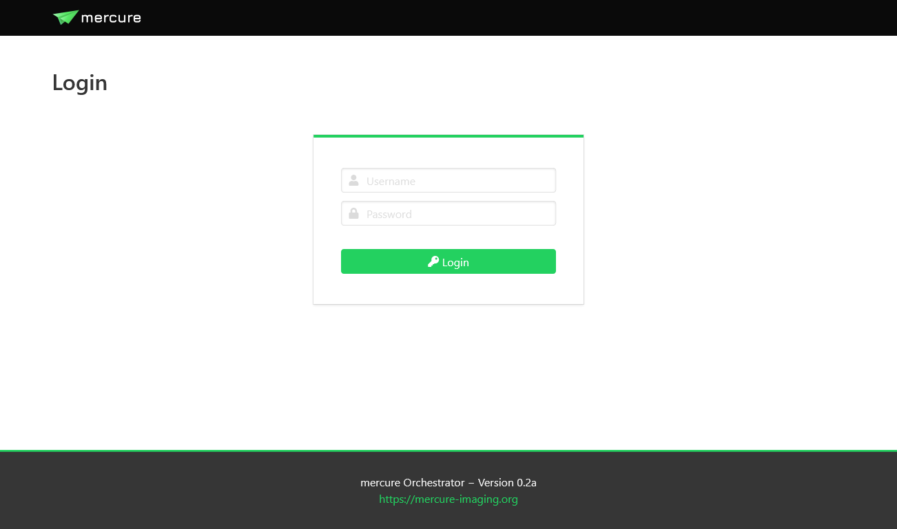

During the installation, mercure creates a "seed account" that you need to use for the first login. You will be asked to change the password after the first login.

.. note:: The login credentials for the first login are: Username = admin, Password = router

To end your session, use the menu on the top-right and select "Logout".

User management
---------------

Users can be created, modified, and deleted on the "Users" page. There are two types of users: Normal users, who can view the configuration and status but not change any settings, and administrators, who have full access. Users with administration rights are indicated by an icon with a shield in the user list. Users can also be added to permission groups. Permission groups are not yet used for anything, but they will be used in future mercure versions to provide granular access control.

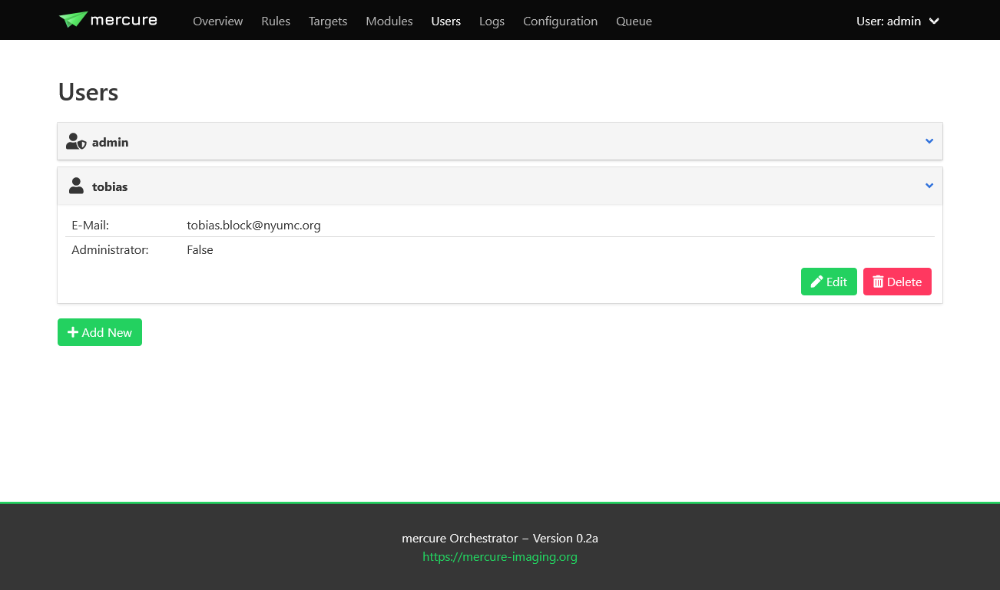

.. tip:: You should create separate accounts for every person using mercure. This will allow you to review which user made changes to the server configuration, as mercure is keeping track of all configuration changes.

System status and control
-------------------------

The status of the mercure server and its service components can be monitored on the "Overview" page. If a service module is running, it will be shown in green color, otherwise it is shown in red. In normal operation, everything should be green. 

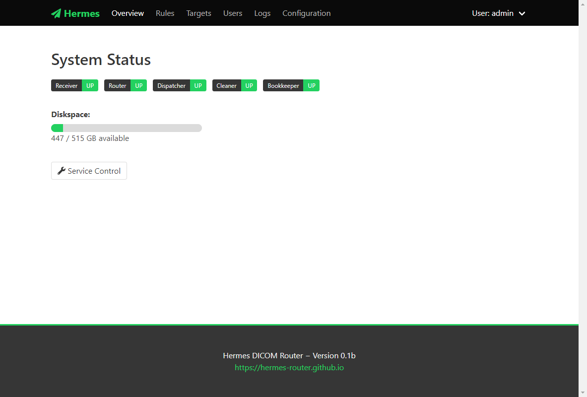

The Overview page also shows the disk space available in the folder for buffering the incoming DICOM files. If this bar turns yellow or red, make sure to free up disk space as the mercure server will not be able to receive images if the disk is completely full.

You can start, stop, and restart services by clicking the "Service Control" button. This will show a dialog where you can select which service(s) to control and which operation to execute (e.g., start or stop). If a service does not react anymore at all, it is also possible to kill a service. 

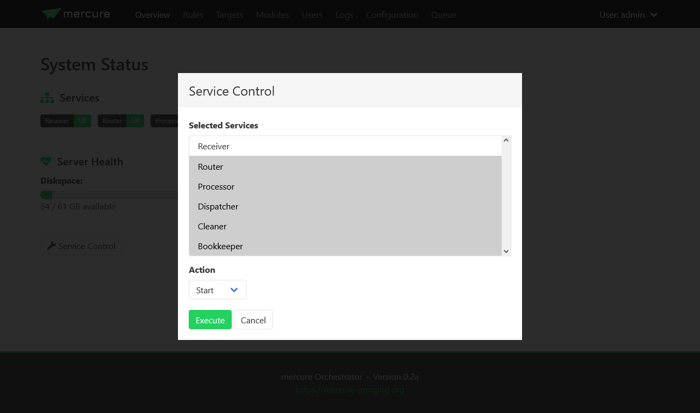

.. note:: If you stop a service, it might take a short moment until the service goes down. This is because the services have been designed to finish the active task before terminating. 

.. note:: The "Service Control" button is only available for systemd- and Docker-type installations but not for Nomad-type installations. Nomad directly takes care restarting services.

.. tip:: If you don't want to use the web interface, you can also manually control the mercure services from the command line. For systemd-type installations, this can be done with the command "systemctl start -u mercure_router.service" (in this example for the routing service). You can find the names of the individual services in the file **/opt/mercure/config/services.json**.

Configuring targets
-------------------

Target nodes that should receive processed and routed DICOM series (via DICOM, DICOM+TLS or SFTP connection) can be defined and configured on the "Targets" page. The first page shows an overview of the currently configured targets. By clicking on an individual item, you can see the target details (e.g., IP address and port). You can test if the target can be reached by clicking the "Test" button, which will try to ping the server and open a connection (via C-Echo or SFTP).

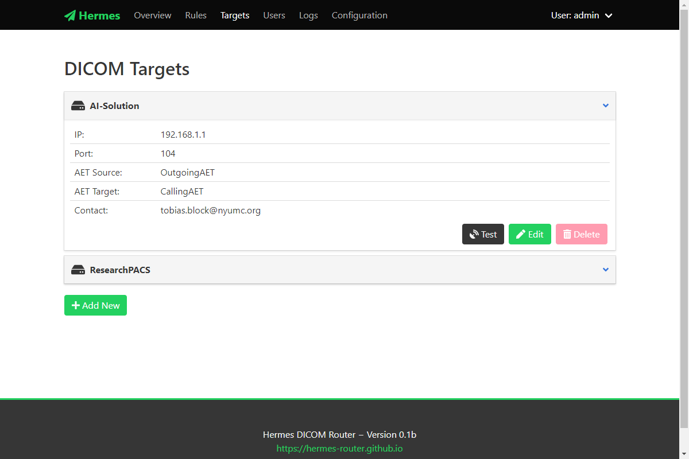

Click the "Add New" button to create a new target. This can be done during normal operation of the server, i.e. it is not necessary to stop any of the services for adding new targets.

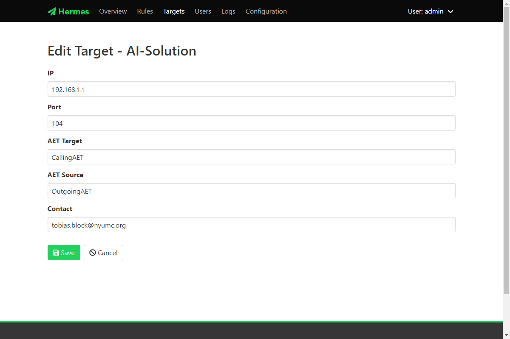

After choosing a unique name for the target, you can edit the target settings. First, you need to select the type of target. Currently, DICOM targets and SFTP targets are supported (other target types, such as DICOMweb, will be added at later time).

For DICOM targets, enter the parameters of the DICOM node, including the IP address, port, the target AET (application entity title) that should be called on the receiver side, and the source AET with which mercure identifies itself to the target.

.. tip:: Some DICOM nodes require that you set a specific target AET, while other systems ignore this setting. Likewise, some DICOM nodes only accept images from a sender who's source AET is known, while others ignore the value. Please check with the vendor/operator of your DICOM node which values are required.

For SFTP targets, enter the hostname or IP, target folder on the server, username, and password. 

.. tip:: It is recommended to create a restricted user account for the SFTP uploads. Never use the credentials of an account with access to sensitive information, as the SFTP credentials are stored in the configuration file.

.. important:: Support for SFTP transfers is still experimental and should be used with care.

For DICOM TLS targets, enter the TLS client key path, TLS client certificate path, and the path to the Certificate Authority (CA) certificate file. You will need to add these files to your mercure installation, e.g. in `/opt/mercure/certs`.

.. important:: Support for DICOM TLS transfers is still experimental and should be used with care.

On the "Information" tab, you can add information for documentation purpose, including a contact e-mail address (so that it can be looked up who should be contacted if problems with the target occur) and a description of the target.

Installing modules
------------------

An overview of the installed processing modules can be seen on the "Modules" page. Details are shown by clicking on an item, which also allows editing the module settings.

.. image:: ui_modules.png
   :width: 550px
   :align: center
   :class: border

To setup a new processing module, click the "Install Module" button. Select a unique name for the module. It is possible to install the same processing module multiple times under different names with different settings. Specify the processing module by entering the Docker Tag.

.. note:: The Docker Tag corresponds to the name of the processing module as stored on Docker Hub (example: mercureimaging/mercure-testmodule). For modules that are not distributed via Docker Hub, the Docker container needs to be built locally on the server before it can be used by mercure. 

Afterwards, you can edit additional Docker-specific settings on the "Docker" tab (additional volumes, environment variables, etc.). In most cases, these settings are not needed. 

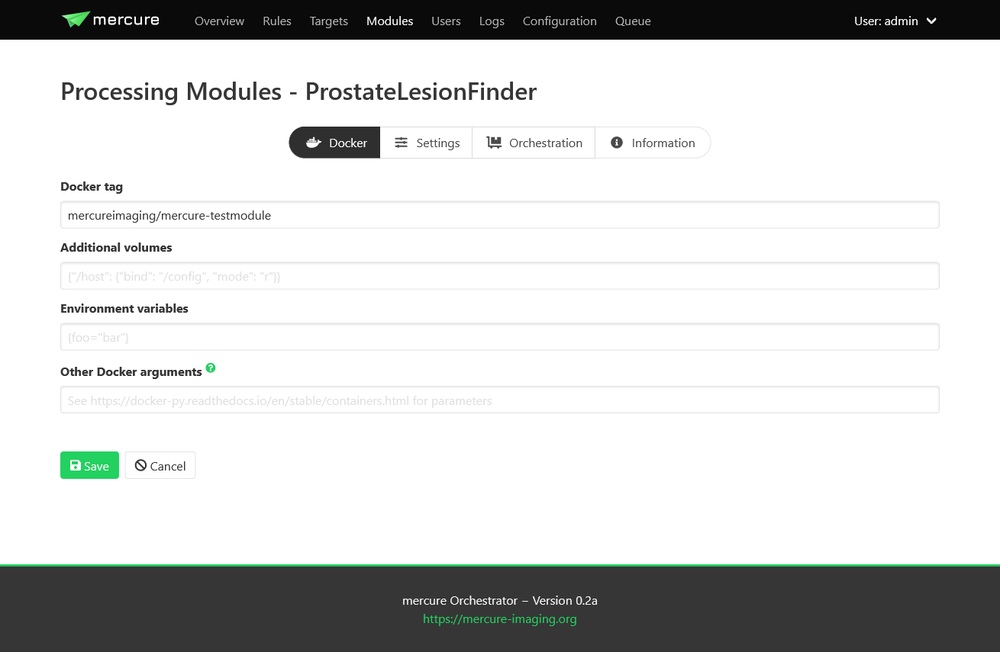

Settings for the processing module can be defined on the "Settings" tab. These settings must be entered in **JSON format**. The settings entered on the module page are global modules settings, i.e. they are applied whenever the module is used. The global module settings can be overwritten (or extended) by defining settings for the individual rule (thus, the settings passed to the module are the global module settings merged with the rule-specific processing settings).

The "Orchestration" tab allows configuring Nomad-specific settings. If you have a systemd- or Docker-type installation, these settings are irrelevant and can be ignored. It is possible to specify "Execution constraints" if the module should be executed on a certain node of your processing cluster (e.g., if a specific GPU or operating system is needed). The field "Resource requirements" can be used to request resources needed for execution of the module (e.g., the amount of memory or CPU cores).

The "Information" tab can be used to document the current module setup, including a free-text description as well as contact e-mail address.

Defining rules
--------------

After you have configured your targets and processing modules, you can define rules that specify which DICOM series should be processed and to which targets the images should be dispatched. This can be done on the "Rules" page.

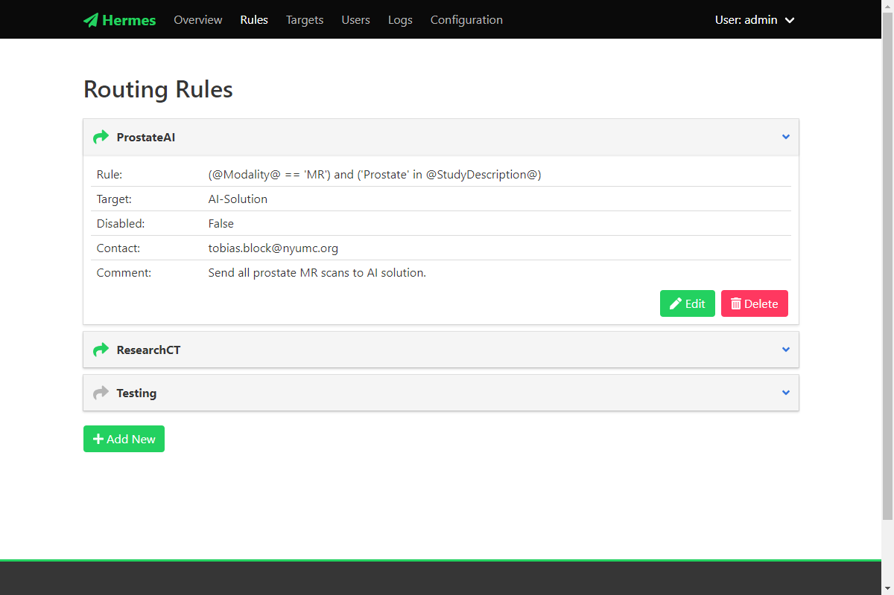

It is not necessary to stop mercure services while defining new rules. The mercure service modules will automatically reload the new configuration when a rule has been added or modified. Click the "Add New" button to create a new rule, or click on any of the existing rules and select "Edit" to modify it.

**Filtering tab**

All rules are evaluated whenever a new DICOM series has been received. The rules can use a set of DICOM tags extracted from the incoming DICOM files. To see the full list of DICOM tags available for writing rules, click the "Available Tags" button.

.. tip:: If you need additional tags that are currently not in the list, please contact us (or modify the getdcmtags module yourself).

When writing the selection rule, tags can be referenced using the format @TagName@, for example @PatientName@. When the rule gets evaluated, such tag placeholder will be replaced with the values read from the individual received DICOM series.

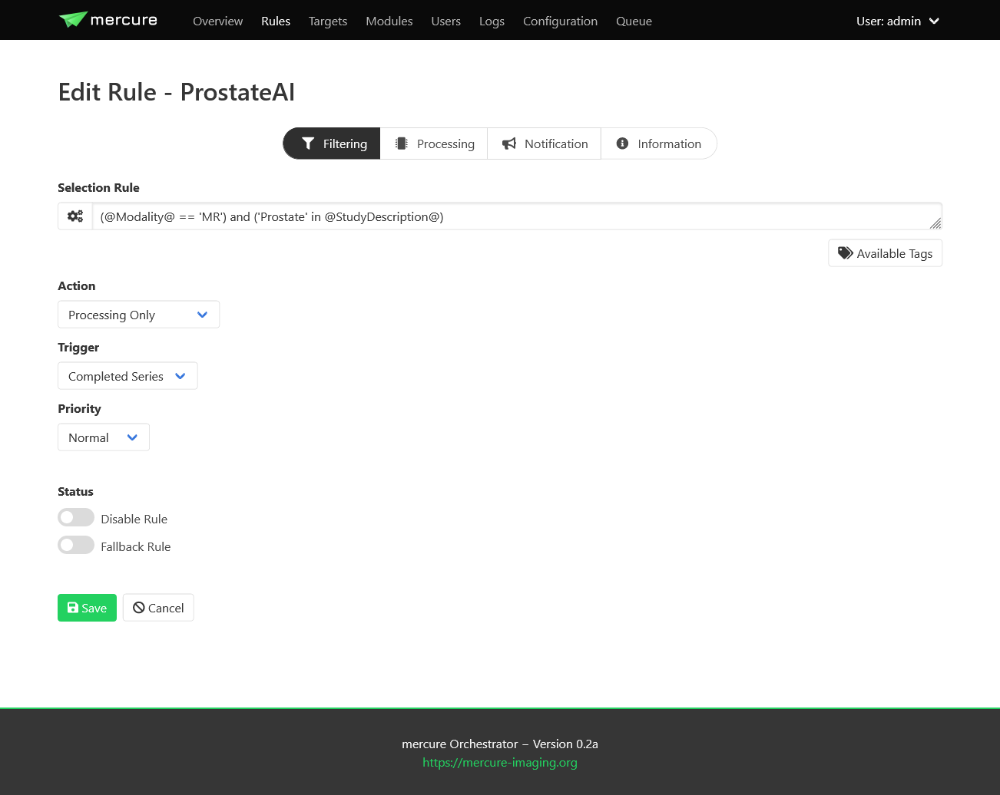

A received series will processed if the selection rule evaluates to True, and it will be ignored if the rule evaluates to False. If none of the defined rules evaluates to True, the series will be discarded.

Selection rules can be written in a Python-like syntax. For example, the rule

.. highlight:: none

:: 

  'CINE' in @SeriesDescription@

will activate for all series that have the word "CINE" in the series description (e.g., "CINE 2ch"). If you only want to send series that are exactly called "CINE", use the following rule instead
:: 

  @SeriesDescription@ = 'CINE'

This rule would not trigger if the series is called "CINE 2ch". Multiple conditions can be combined using the "or" and "and" operators. Here, it is recommended to enclose every sub-condition with "( )". By default, DICOM tags are treated as strings and are case-sensitive. If you want to make your condition case-insensitive, then append ".lower()" to the tag. For example, the rule 
:: 

  @SeriesDescription@.lower() = 'cine'

would trigger for series called "CINE" or "cine". If you want to test for numerical value thresholds (e.g., if the slice thickness is lower than 2mm), you first need to convert the tag into a float by writing the tag inside "float( )". This then allows you to write a rule like
:: 

  float(@SliceThickness@) < 2.0

To test a selection rule before activating it, click the icon with the cog wheels on the left side of input box. If you see a red icon in the dialog, the rule notation is invalid (the dialog will tell you why). If the rule is valid, the dialog will test if the rule would trigger if a DICOM series with the values shown in the lower part of the dialog would be received. You can modify these values and test if the rule reacts as expected.

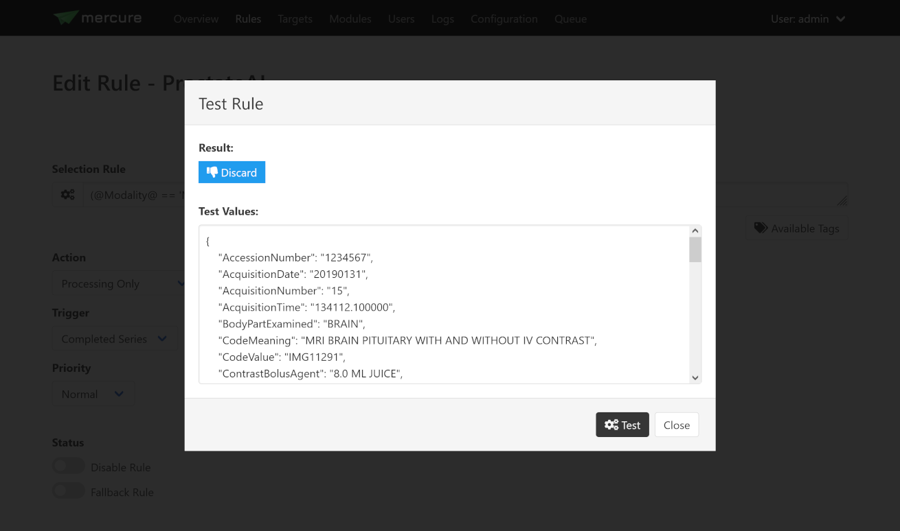

.. hint:: If you make a mistake while changing the test values (e.g., missing a quotation mark), you will see a yellow icon. 

If you have validated that your rule triggers as expected, select the desired Action from the drop-down list. The following options are available:

==================== ===============================================================================
Action               Meaning
==================== ===============================================================================
Routing              The received series/study will be dispatched to a target (no processing)
Processing & Routing The received series/study will be processed and afterwards dispatched
Processing only      The received series/study will be processed (without further dispatching)
Notification only    A notification will be triggered if the series/study is received (without neither processing or dispatching)
Force discard        The received series/study will be discarded (no other rules will be evaluated)
==================== ===============================================================================

Depending on the selected Action, the tabs "Processing" and "Routing" will become visible. 

The Trigger control allows selecting when the action should be triggered. If "Completed Series" has been selected, the action is executed when a DICOM series has been received for which the rule evaluates to True. Thus, if multiple series from a patient study are received, these series are processed separately. However, sometimes it is required to process all DICOM series from one patient study together. For example, an AI-based analysis algorithm might require multiple series with different contrast. In this case, the option "Completed Study" needs to be selected, and the additional control "Completion Criteria" will appear, which allows selecting when the study should considered complete. 

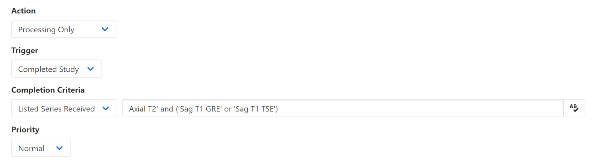

If it is known which image series are required for the processing, this information can be utilized with the option "List Series Received". It is then necessary to list the Series Descriptions of the required series in the input box on the right side. Here, it is possible to enter substrings of the Series Description and it is possible to combine multiple options using the keywords "or" and "and". This allows handling variability in the Series Descriptions, which often occurs in practice due to inconsistent configuration of imaging devices. If the names of the expected series are unknown, the option "Timeout Reached" can be used, which collects image series belonging to the same study until no further series has been received for a definable timeout period (the timeout time can be set on the Configuration page). A disadvantage of this option is that the processing will be delayed until the timeout period has expired.

If the Priority control is set to "Urgent", corresponding series or studies will be pushed to the front of the processing queue, while the setting "Off-Peak" enforces that the corresponding series will be only processed at night time. The latter can be helpful to avoid that computationally demanding research studies might delay clinical routine processing during normal work hours.

Rules can be temporarily disabled by toggling the "Disable Rule" switch. In this case, the rule appears in grayed-out color in the rule list and it will be ignored during processing. By clicking the "Fallback Rule" switch, the current rule will be applied to all DICOM series for which no other rules have triggered. This allows defining a "default" rule.

**Processing tab**

For rules involving processing, the "Processing" tab can be used to select the processing module that should be executed and to provide rule-specific module settings. These settings will be merged with the global module settings and will overwrite global settings if the same keys occur in both settings. The settings have to be specified in JSON format. It depends on the individual module which settings are available. This information should be looked up from the module documentation. 

.. image:: ui_rules_edit_processing.png
   :width: 550px
   :align: center
   :class: border

When selecting the "Retain input images" switch, the module will output both the processed images as well as the unprocessed input images. It depends on the individual application if this option is desired or not.

.. important:: The "Retain input images" option must not be used with modules that should remove confidential information from the data, such as DICOM anonymization modules.

**Routing tab**

For rules involving dispatching, the "Routing" tab can be used to select the target to which the DICOMs should be dispatched (after finishing processing modules, if selected). At this time, images can only be dispatched to a single target per rule. If images should be sent to multiple destinations, it is currently necessary to define multiple rules with different target. This limitation will be removed in future versions of mercure.

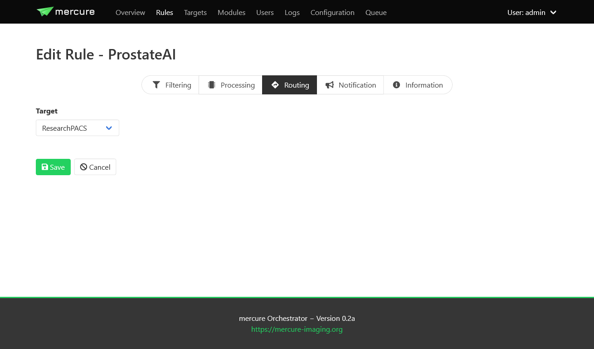

**Notification tab**

The "Notification" tab allows configuring webhook calls that are triggered when the rule gets activated, when the processing completes, and when an error occurs that is related to the rule. Webhook calls can be used to send notification messages into Slack, WebEx, Teams, or comparable messaging services. They can also be used for connecting other external services, for example, changing the color of a physical status light.

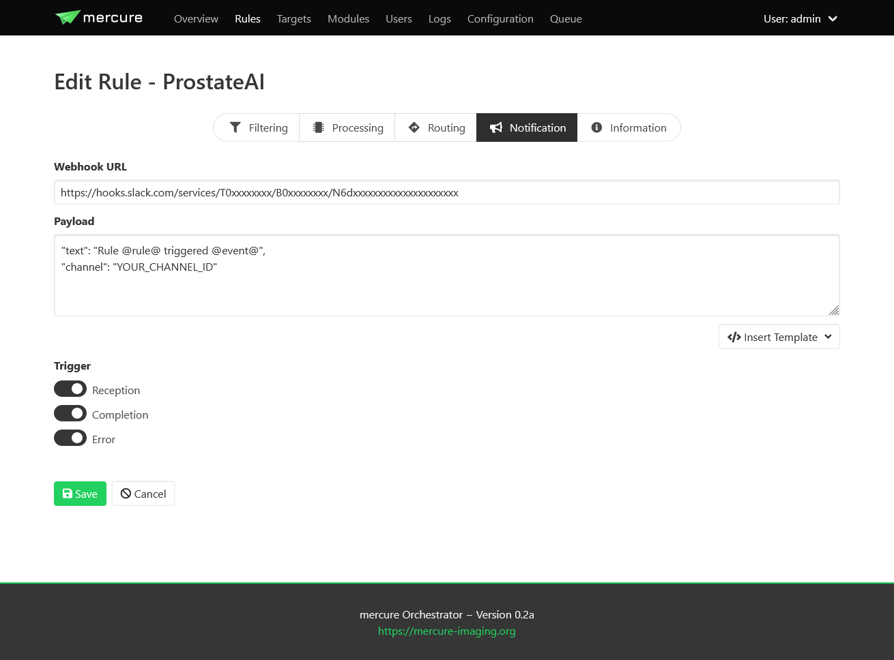

The URL and payload for the webhook call need to be provided. Payload templates for Slack and WebEx can be inserted by pressing the button "Insert Template". To obtain the webhook URL, you need to go into the configuration of your messaging service (e.g., Slack) and follow the instruction for setting up an incoming webhook.

.. important:: Do not send any sensitive information in the payload because the webhook call will, in most cases, be sent to an externally operated service.

**Information tab**

The "Information" tab can be used to document the rule. The purpose of the rule can be written as free-text into the Comment field, and an email address can be written into the Contact field, so that it can be looked up at a later time why the rule was defined and who requested it. It is also possible to add tag attributes to the rule. These tags are not yet used for anything else, but might be used in future versions of mercure for filtering purpose and access control.

.. image:: ui_rules_edit_information.png
   :width: 550px
   :align: center
   :class: border

Queue management
----------------

The "Queue" page allows monitoring the status of mercure's processing and routing queues, and it provides basic functions for modifying jobs in the processing queue.

.. image:: ui_queue.png
   :width: 550px
   :align: center
   :class: border

.. note:: By default, the views do not update automatically when the page is open, as this could have negative impact on the server load. Press the Refresh button in the top-right corner to update the queue lists. When pressing the Auto Update button, the view will be updated every 10 sec.

**Queue status**

The upper part of the page indicates if mercure is currently processing or routing images. Using the switches "Suspend Queue", you can halt the processing or routing queue. In this case, mercure will finish the active job but will not start another job until the queue has been started again. This can be helpful if it is necessary to patch job parameters, or if module settings need to be changed before additional series can be processed.

**Job status**

The lower part of the page shows the status of individual jobs in mercure's different queues. 

.. important:: Some of the functions for modifying jobs are still incomplete and will be added in future versions of mercure.
 
The "Processing" tab shows the jobs currently placed in the processing queue, i.e. jobs (series or studies) for which processing modules are executed. You can mark jobs by clicking on the corresponding row. This will activate the toolbar above the table, which allows, e.g., displaying additional job information or deleting jobs. Similarly, the "Routing" tab shows the outgoing jobs currently placed in the routing queue.

.. image:: ui_queue_processing.png
   :width: 550px
   :align: center
   :class: border

The "Studies" tab show the list of studies currently waiting for complete image arrival, i.e. studies for which a study-level rule has triggered and for which DICOM series are still being collected. It allows enforcing the completion of the series collection by clicking the button "Force study completion".

The "Failure" tab shows a list of all jobs for which processing errors have occurred, including errors during preparation, processing, and routing. Failed jobs can be restarted -- if possible depending on the error type.

The "Archive" tab shows a search box that allows reviewing the status of series/studies still residing on the server that have completed processing/routing or that have been discarded because no rule had triggered. Because there is typically a high number of such jobs, it has been implemented as search box instead of a table with all entries. In the future, it will be possible to reprocess such cases (e.g., if a series had not been processed because the selection rule was incorrect).

.. note:: If you send a DICOM series to mercure, it takes a short time before the series becomes visible on the Queue page (i.e. on the Processing, Routing, or Studies tab) because mercure first waits for expiration of the series completion timeout (60 sec by default).
